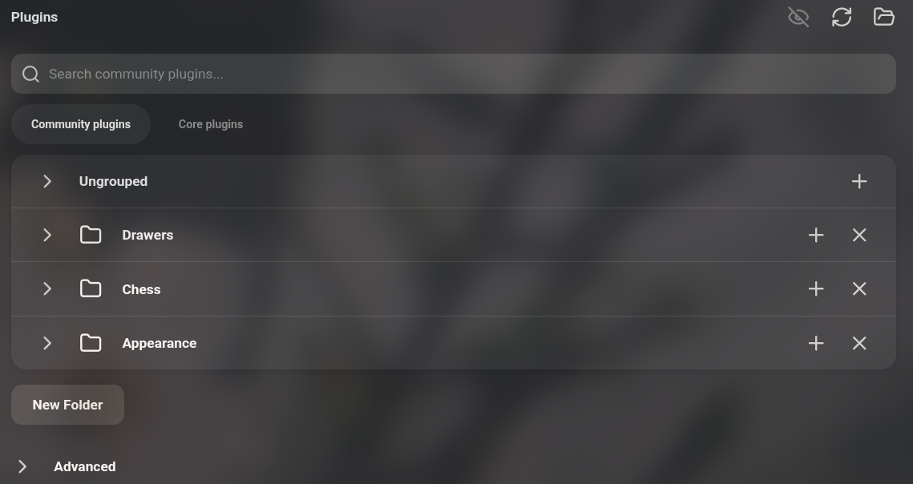
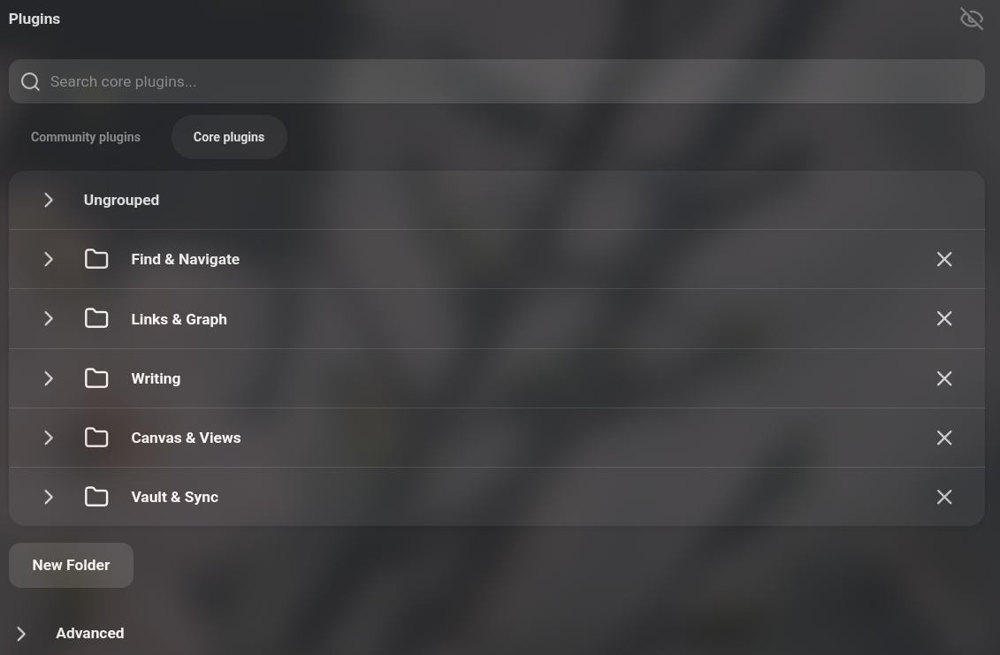

# Plugin Drawers

Organise Obsidian's community and core plugins into collapsible folders, in one Plugins tab.

<table align="center">
	<tr>
		<th>Community plugins</th>
		<th>Core plugins</th>
	</tr>
	<tr>
		<td align="center"></td>
		<td align="center"></td>
	</tr>
</table>

## Features

- Merges the Community plugins and Core plugins tabs into a single **Plugins** tab.
- Group plugins into folders. The core list starts out sorted into five folders.
- Rename, collapse and delete folders.
- Install community plugins directly into a certain folder
- Hide/Show plugins' options in the Preferences sidebar

## Usage

Open **Settings -> Plugins**. Choose **Community plugins** or **Core plugins** under the search box, click **New Folder** below the list to create a folder, then drag plugins into it.
To browse community plugins, use a folder's **+** button.

While the plugin is enabled it replaces Obsidian's built-in plugin lists and hides the Core plugins tab. Disabling it restores both tabs as they were.

**IMPORTANT FOR REVIEW: This plugin overrides Obsidian's native functionality**

## Compatibility

Desktop only. Requires Obsidian 1.13 or later.

## Installation

Install **Plugin Drawers** from **Settings -> Community plugins -> Browse**, then enable it.

To install manually:

Copy `main.js`, `manifest.json` and `styles.css` from the latest release into `<vault>/.obsidian/plugins/plugin-drawers/`.
